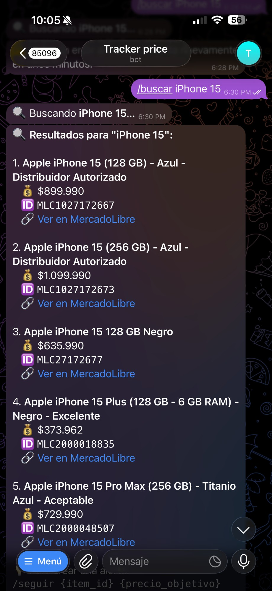
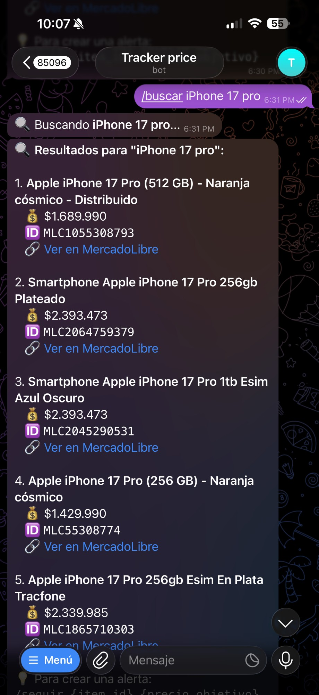
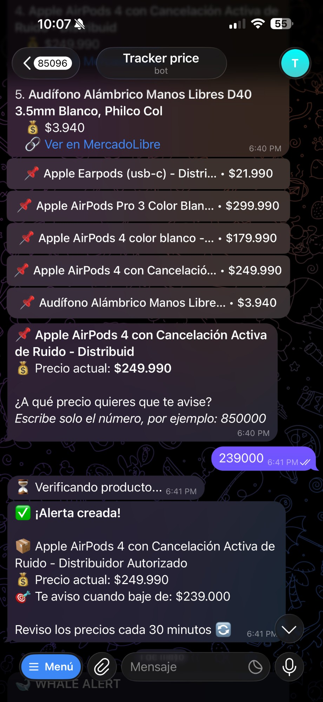

# ML Price Tracker

**Telegram bot that monitors MercadoLibre Chile product prices and alerts you when they drop to your target.**


---

## The Problem

If you want to buy something on MercadoLibre — a phone, laptop, appliance — the price fluctuates daily. The only way to catch a good deal is to check manually, which means remembering to do it, opening the site, finding the product, and comparing.

Most people either pay full price or miss the sale entirely.

## The Solution

Send a Telegram message with the product and your target price. The bot checks the price every 30 minutes and messages you the instant it drops below your goal. No app, no signup, no API key required.

---

## Screenshots

| Search results | Alert setup | Price drop notification |
|---|---|---|
|  |  |  |

---

## Features

- **Product search** — search MercadoLibre Chile by keyword, get top results with prices and links
- **Price alerts** — set a target price per product; bot tracks it every 30 minutes
- **Instant notifications** — Telegram message the moment price drops to or below target
- **Concurrent users** — async job scheduling handles multiple users simultaneously
- **Alert management** — list active alerts, delete by ID
- **Persistent storage** — SQLite database survives restarts
- **No MercadoLibre account required** — uses the public API (no auth, no scraping)
- **No API key required** — just a free Telegram bot token
- **17 passing tests** — all HTTP calls mocked; runs without credentials
- **Docker ready** — one command deploy

---

## How It Works

```
User                    Bot                   MercadoLibre API
 │                       │                          │
 │─ /buscar iphone 15 ──▶│                          │
 │                       │─ GET /sites/MLC/search ─▶│
 │                       │◀─ 5 results ─────────────│
 │◀─ numbered list ──────│                          │
 │                       │                          │
 │─ /seguir MLC123 850000▶│                          │
 │                       │─ GET /items/MLC123 ──────▶│
 │                       │◀─ price: $900.000 ────────│
 │◀─ "Te aviso cuando baje de $850.000" ────────────│
 │                       │                          │
 │            [ every 30 min — APScheduler ]        │
 │                       │─ GET /items/MLC123 ──────▶│
 │                       │◀─ price: $820.000 ────────│
 │◀─ "🔔 ¡Bajó el precio! $820.000" ───────────────│
```

---

## Bot Commands

```
/start              Welcome message and quick intro
/buscar {query}     Search products on MercadoLibre Chile
/seguir {id} {price}  Create a price alert for a product
/mis_alertas        List your active alerts
/borrar {id}        Delete an alert by ID
/ayuda              Show all commands with examples
```

---

## Demo Conversation

```
You: /buscar iphone 15

Bot: 🔍 Resultados para "iphone 15":

     1. iPhone 15 128GB Negro
        💰 $749.990
        🆔 MLC1234567890
        🔗 Ver en MercadoLibre

     2. iPhone 15 Pro 256GB Titanio
        💰 $1.099.990
        🆔 MLC9876543210
        🔗 Ver en MercadoLibre

You: /seguir MLC1234567890 700000

Bot: ✅ ¡Alerta creada!
     📦 iPhone 15 128GB Negro
     💰 Precio actual: $749.990
     🎯 Te aviso cuando baje de: $700.000
     Reviso los precios cada 30 minutos 🔄

[ 3 days later ]

Bot: 🔔 ¡Bajó el precio!
     📦 iPhone 15 128GB Negro
     💰 Precio actual: $689.990
     ✅ Tu objetivo era: $700.000
     🛒 Ver en MercadoLibre
```

---

## Architecture

```
Telegram
  │  incoming messages
  ▼
[bot/handlers.py]           Command handlers (/buscar, /seguir, /mis_alertas, /borrar)
  │
  ├──▶ [services/mercadolibre.py]   httpx async client → MercadoLibre public API
  │       search() → list of items
  │       get_item() → current price
  │
  └──▶ [models/database.py]         SQLAlchemy 2.0 — User + Alert tables (SQLite)

[APScheduler — every 30 min]
  └──▶ [services/alerts.py]
         for each active alert:
           current_price = get_item(item_id)
           if current_price ≤ target_price:
             send Telegram notification
             mark alert as triggered

[api/main.py]               FastAPI — GET /health (for Docker healthcheck)
```

---

## Tech Stack

| Layer          | Technology                              |
|----------------|-----------------------------------------|
| Bot framework  | python-telegram-bot v20 (async)         |
| HTTP client    | httpx (async)                           |
| Scheduler      | APScheduler (via PTB JobQueue)          |
| Database       | SQLite via SQLAlchemy 2.0               |
| Health check   | FastAPI                                 |
| Testing        | pytest + respx (HTTP mocks)             |
| Containerization | Docker + Docker Compose               |
| CI/CD          | GitHub Actions                          |

---

## Data Model

```
User
├── id
├── telegram_id   (unique)
├── username
└── created_at

Alert
├── id
├── user_id       → User.id
├── item_id       (e.g. MLC1234567890)
├── item_name
├── item_url
├── target_price
├── current_price
├── is_active
├── created_at
└── triggered_at
```

---

## Quickstart

### Docker (recommended)

```bash
git clone https://github.com/Arcan17/ml-price-tracker.git
cd ml-price-tracker
cp .env.example .env
# Edit .env — set TELEGRAM_BOT_TOKEN
docker-compose up --build
```

Health check: `http://localhost:8080/health`

### Local

```bash
git clone https://github.com/Arcan17/ml-price-tracker.git
cd ml-price-tracker

python -m venv .venv
source .venv/bin/activate
pip install -r requirements.txt

cp .env.example .env
# Edit .env — set TELEGRAM_BOT_TOKEN

python main.py
```

**Getting a Telegram bot token (free):**
1. Open Telegram → search **@BotFather**
2. Send `/newbot` and follow instructions
3. Paste the token into `.env`

---

## Environment Variables

| Variable             | Description                          | Default                       |
|----------------------|--------------------------------------|-------------------------------|
| `TELEGRAM_BOT_TOKEN` | Token from @BotFather                | *(required)*                  |
| `DATABASE_URL`       | SQLAlchemy connection string         | `sqlite:///./data/bot.db`     |
| `CHECK_INTERVAL`     | Price check interval in seconds      | `1800` (30 min)               |
| `LOG_LEVEL`          | Logging verbosity                    | `INFO`                        |

---

## Running Tests

All HTTP calls to MercadoLibre are mocked with **respx** — no token or internet connection needed.

```bash
pytest tests/ -v
```

```
tests/test_mercadolibre.py    9 passed   ← API client, search, price fetch
tests/test_alerts.py          8 passed   ← alert trigger logic, deactivation
──────────────────────────────────────────
17 passed in 0.6s
```

---

## Project Structure

```
ml-price-tracker/
├── main.py                  # Entry point: bot + scheduler + health API
├── bot/
│   ├── handlers.py          # Telegram command handlers
│   └── messages.py          # Bot text (Chilean Spanish)
├── services/
│   ├── mercadolibre.py      # httpx async client — MercadoLibre public API
│   └── alerts.py            # Price check loop + notification logic
├── models/
│   └── database.py          # SQLAlchemy ORM — User, Alert tables
├── api/
│   └── main.py              # FastAPI health check (for Docker)
├── tests/
│   ├── conftest.py
│   ├── test_mercadolibre.py
│   └── test_alerts.py
├── docs/screenshots/
├── Dockerfile
├── docker-compose.yml
├── requirements.txt
├── .env.example
└── .github/workflows/ci.yml
```

---

## Technical Decisions

**Why python-telegram-bot v20 (async)?**
Version 20 is fully async — handlers, schedulers, and HTTP calls all run on the same event loop. This makes it trivial to handle dozens of concurrent users without threading complexity.

**Why MercadoLibre's public API instead of scraping?**
The public product endpoint (`/items/{id}`) is stable, fast, and requires no authentication for read operations. Scraping would be fragile and require browser automation for JavaScript-rendered content. Using the official API means the bot stays reliable long-term.

**Why SQLite?**
The access pattern is one user → one alert → one price check. There's no concurrent write contention. SQLite is zero-config, persists across restarts, and is trivially portable. PostgreSQL would add operational overhead for no meaningful benefit at this scale.

**Why APScheduler (via PTB JobQueue) instead of a cron job?**
The scheduler lives inside the bot process, so alerts are user-specific (stored in DB with per-user data) and can be created/deleted at runtime. A cron job would require re-reading the full alert list every interval and couldn't handle per-user state cleanly.

---

## Known Limitations

- **MercadoLibre Chile only** — the site code `MLC` is hardcoded; other countries (MLA, MLM) would require configuration
- **No price history** — only current price is stored; can't show price trend over time
- **30-minute granularity** — flash sales shorter than 30 minutes may be missed
- **Single product per alert** — no "track the cheapest iPhone 15 across all listings" support
- **No web dashboard** — all interaction is through Telegram commands only

---

## Roadmap

- [ ] Deploy public instance (Railway + persistent volume)
- [ ] `/historial {id}` — price history chart for a tracked product
- [ ] Price drop percentage alerts (e.g. "alert me when it drops 15%")
- [ ] Support MercadoLibre Argentina (`MLA`) and Mexico (`MLM`)
- [ ] Web dashboard for managing alerts from a browser
- [ ] Weekly summary: most tracked products, biggest drops

---

## Use Cases

The same architecture — **API client + scheduler + Telegram bot + database** — applies directly to:

- **Flight price monitoring** (Skyscanner, Despegar)
- **Real estate listing alerts** (Portal Inmobiliario, Yapo)
- **Competitor price tracking** for e-commerce
- **Stock or crypto price alerts**
- **Job listing monitors** (LinkedIn, GetOnBoard)
- **Inventory / stock alert bots**

Any "check a value every N minutes and notify when a condition is met" use case maps directly to this template.

---

## License

MIT
